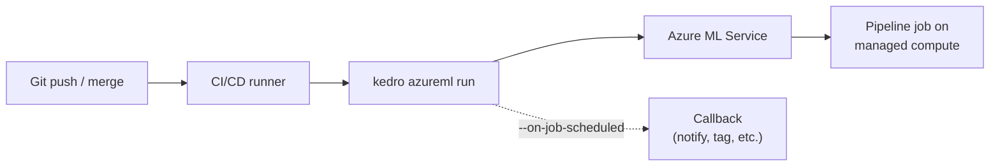

# How to Deploy Pipelines from CI/CD

This guide shows how to submit Azure ML pipeline jobs from a CI/CD system using service principal authentication and the plugin CLI.



## Prerequisites

- The Kedro AzureML Pipeline plugin installed and configured (see [Getting Started](../tutorials/getting-started.md))
- An Azure [service principal](https://learn.microsoft.com/en-us/azure/active-directory/develop/app-objects-and-service-principals) with the `Contributor` or `AzureML Data Scientist` role on your workspace
- CI/CD runner with Python 3.11+ and `az login` or environment variable authentication

## Configure service principal authentication

The plugin uses `DefaultAzureCredential` from the Azure Identity SDK. For CI/CD, set these environment variables in your CI/CD secrets:

```bash
AZURE_TENANT_ID="<your-tenant-id>"
AZURE_CLIENT_ID="<your-client-id>"
AZURE_CLIENT_SECRET="<your-client-secret>"
```

See [How to authenticate](authenticate.md) for service principal creation, role assignments, and troubleshooting.

## Validate before deploying

Before a deploy step ever contacts Azure ML, gate it on a credential-free compile check:

```bash
kedro azureml compile --check --all
```

`--check` compiles every resolved job in memory, writes no files, and exits non-zero if any job fails to compile, so a misconfigured `azureml.yml` or a broken pipeline fails the build instead of the deploy. Because it needs no Azure ML credentials and submits nothing, it is safe to run on every pull request, before secrets are available. See the [`compile` CLI reference](../reference/cli.md#kedro-azureml-compile) for the flag details and [Compile and inspect](compile-and-inspect.md#validate-that-every-job-compiles) for a walkthrough.

## GitHub Actions example

```yaml
name: Deploy pipeline
on:
  push:
    branches: [main]

jobs:
  deploy:
    runs-on: ubuntu-latest
    env:
      AZURE_TENANT_ID: ${{ secrets.AZURE_TENANT_ID }}
      AZURE_CLIENT_ID: ${{ secrets.AZURE_CLIENT_ID }}
      AZURE_CLIENT_SECRET: ${{ secrets.AZURE_CLIENT_SECRET }}

    steps:
      - uses: actions/checkout@v4

      - uses: astral-sh/setup-uv@v5

      - run: uv sync --no-dev

      - name: Validate jobs compile
        run: uv run kedro azureml compile --check --all

      - name: Submit pipeline
        run: uv run kedro azureml run -j training --wait-for-completion
```

## Use a callback for notifications

The `--on-job-scheduled` flag accepts a `module:function` reference that is called after each job is submitted. Use this to send notifications or trigger downstream workflows:

```python
# myproject/callbacks.py
def notify_slack(job_info):
    """Called after the Azure ML job is submitted."""
    # job_info contains the job object returned by Azure ML
    print(f"Job submitted: {job_info.studio_url}")
```

```bash
kedro azureml run -j training --on-job-scheduled myproject.callbacks:notify_slack
```

## Submit a dependent batch (fail-fast)

Pass `-j` multiple times to submit several jobs in one invocation. They are submitted **in the order given**, and submission is **fail-fast**: if a job fails, the remaining jobs are skipped instead of launched.

```bash
kedro azureml run -j snapshot -j training -j inference --wait-for-completion
```

This is the right ordering when later jobs depend on earlier ones (here `inference` consumes `training`'s model, which consumes `snapshot`'s data). If `training` fails, `inference` is skipped and the command exits non-zero, so a CI deploy step fails loudly rather than launching a job that would read missing outputs. See [the CLI reference](../reference/cli.md#batch-submission-is-fail-fast) for the exact summary output.

To submit jobs that do **not** depend on each other, so one failure does not skip the rest, run them as separate steps:

```bash
kedro azureml run -j daily_report
kedro azureml run -j weekly_rollup
```

## Override workspace per environment

Use the `-w` flag or Kedro environments to target different workspaces:

```bash
# Using -w flag
kedro azureml run -j training -w prod

# Using Kedro environment with a separate conf/prod/azureml.yml
kedro azureml run -j training --env prod
```

## See also

- [Configuration reference](../reference/configuration.md#workspace) for workspace definitions
- [CLI reference](../reference/cli.md#kedro-azureml-run) for all `run` flags
- [Compile and inspect](compile-and-inspect.md#validate-that-every-job-compiles) for the `compile --check --all` validation gate
- [How to configure multiple workspaces](configure-multiple-workspaces.md) for workspace management
